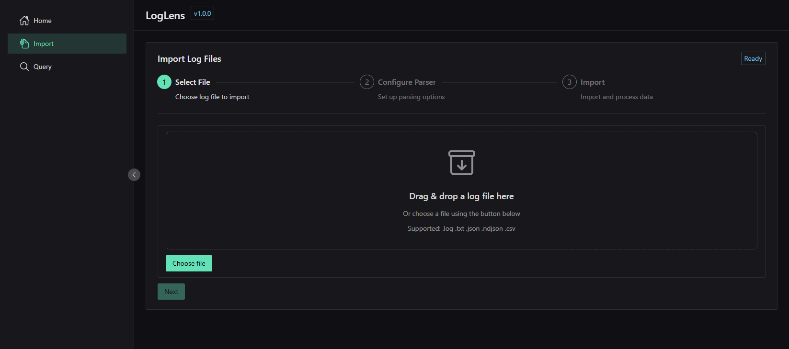
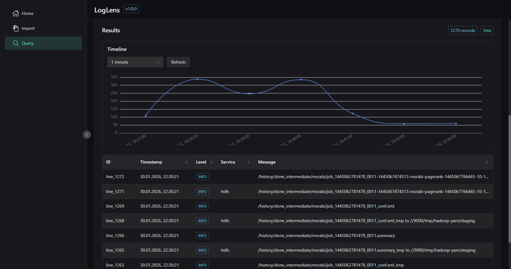

# LogScope

**LogScope** — desktop-приложение для локального анализа больших логов и дампов (сотни MB → десятки GB) без поднятия ELK, ClickHouse или облаков.

Проект предназначен для разработчиков, DevOps и SRE, которым нужно **быстро понять, что происходит в логах**, прямо на своей машине.

---

## Коротко: что делает приложение

* открывает большие лог-файлы потоково (без загрузки в память)
* автоматически распознаёт структуру логов
* позволяет фильтровать, группировать и агрегировать записи
* работает как desktop-приложение (Go + Wails + Vue)

По сути — *«Kibana для одного файла»*, но локально и без сложной инфраструктуры.

---

## Как это выглядит для пользователя

1. Открываешь приложение
2. Перетаскиваешь лог-файл или папку
3. LogScope индексирует данные
4. Ты фильтруешь, группируешь и исследуешь логи в UI

Без ожиданий, серверов и сложной настройки.

---

##  Основные возможности

*  Импорт больших лог-файлов
*  Фильтрация (время, уровень, текст, поля)
*  Автоматическая группировка похожих сообщений
*  Агрегации и базовая аналитика
*  Быстрый drill-down от статистики к строкам

---

## Технологии

* **Backend:** Go
* **Frontend:** Vue 3
* **Desktop shell:** Wails
* **Storage:** SQLite / file-based

---
## Интерфейс

---

## Для кого

* Backend-разработчики
* DevOps / SRE
* Инженеры поддержки
* Security-аналитики

---

##  Статус

🚧 В разработке (pet / R&D)

---

