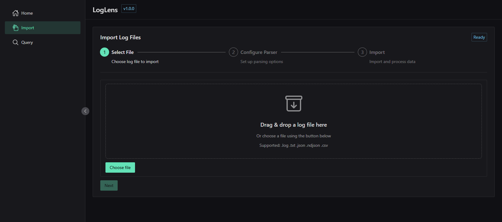
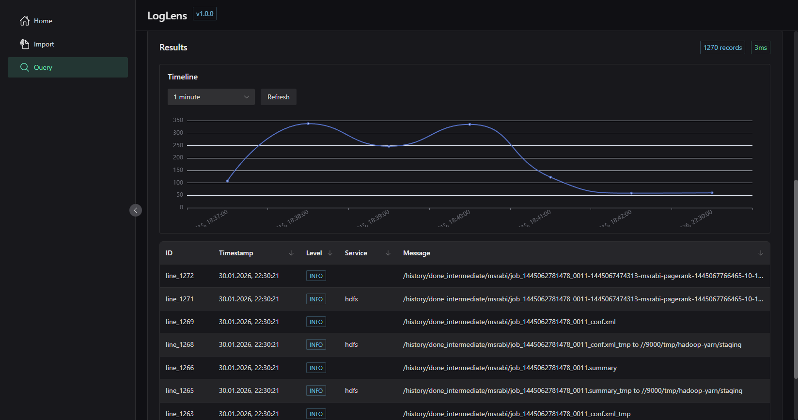
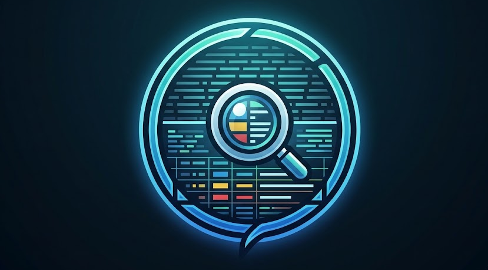

<p align="center">
  <h1 align="center">LogLens</h1>
  <p align="center">Локальный анализатор лог-файлов для desktop</p>
  <p align="center">
    <em>Kibana для одного файла — без серверов, без облаков, без ожидания</em>
  </p>
</p>

<p align="center">
  
  
  
  
  
</p>

---

## Зачем это нужно

Открыт 50-гигабайтный лог. ELK не поднят, ClickHouse недоступен, `grep` уже не справляется. LogLens позволяет открыть такой файл прямо на рабочем машине, пропарсить за секунды и начать исследовать — с фильтрами, агрегациями и визуализацией.

## Как это работает

1. Откройте приложение
2. Перетащите лог-файл или выберите через диалог
3. LogLens распознает формат и проиндексирует записи
4. Фильтруйте, группируйте, исследуйте — всё в интерфейсе

---

## Возможности

| | |
|---|---|
| **Потоковый импорт** | Обработка файлов любого размера без загрузки в память. Прогресс в реальном времени. |
| **Автоопределение формата** | Plain text, JSON/NDJSON, regex-паттерны — формат определяется автоматически по содержимому. |
| **Фильтрация** | По уровню, сервису, тексту, временному диапазону, произвольным полям. RegExp-фильтры. |
| **Временная шкала** | Интерактивный график распределения логов по времени с настраиваемым бакетингом. |
| **Пагинация и сортировка** | Удалённая пагинация, сортировка по любому полю, кастомный лимит. |
| **Экспорт отчётов** | Сохранение результатов запроса и таймлайна в JSON-отчёт. |

---

## Скриншоты

<p align="center">
  
</p>
<p align="center">
  
</p>
<p align="center">
  
</p>

---

## Стек технологий

| Уровень | Технология | Роль |
|---|---|---|
| Backend | **Go 1.25** | Парсинг, фильтрация, хранение, REST-подобный API через Wails bindings |
| Frontend | **Vue 3** + TypeScript 5.9 | UI, визуализация (ECharts), компоненты (Naive UI) |
| Desktop | **Wails 2.11** | Нативная обёртка, WebView2, файловые диалоги, IPC |
| Storage | **SQLite** (modernc.org, CGo-free) | Локальная БД без внешних зависимостей |

---

## Архитектура

```
┌─────────────────────────────────────────────┐
│  Frontend (Vue 3 + Naive UI + ECharts)      │
│  ┌──────┐  ┌──────┐  ┌────────────┐         │
│  │ Home │  │Import│  │   Query    │         │
│  └──┬───┘  └──┬───┘  └─────┬──────┘         │
│     └─────────┼─────────────┘                │
│               │ Wails IPC                    │
├───────────────┼─────────────────────────────-┤
│  Backend (Go) │                              │
│  ┌────────────▼────────────────┐             │
│  │         app.go              │             │
│  │   (Wails-bound methods)     │             │
│  └────────────┬────────────────┘             │
│  ┌────────────▼────────────────┐             │
│  │      internal/app           │             │
│  │       LogLens core          │             │
│  └──┬─────────┬──────────┬────┘             │
│  ┌──▼──┐  ┌──▼────┐  ┌──▼──────┐            │
│  │Parser│  │Filter │  │ Storage │            │
│  │      │  │Engine │  │ (SQLite)│            │
│  └──────┘  └───────┘  └─────────┘            │
└──────────────────────────────────────────────┘
```

---

## Быстрый старт

### Зависимости

- [Go 1.25+](https://go.dev/dl/)
- [Node.js 20+](https://nodejs.org/)
- [Wails CLI](https://wails.io/docs/gettingstarted/installation)

```bash
go install github.com/wailsapp/wails/v2/cmd/wails@latest
```

### Установка

```bash
git clone https://github.com/your-org/LogLens.git
cd LogLens
go mod download
cd frontend && npm install && cd ..
```

### Разработка

```bash
wails dev
```

### Сборка

```bash
wails build
```

Результат: `build/bin/LogLens.exe`

### Тесты

```bash
# Go unit-тесты (21 тест)
go test ./internal/... -v

# Проверка типов TypeScript
cd frontend && npx vue-tsc --noEmit
```

---

## Структура проекта

```
LogLens/
├── app.go                          # Wails bindings, streaming progress
├── main.go                         # Entry point, lifecycle hooks
├── internal/
│   ├── app/loglens.go              # Бизнес-логика, парсинг, хранение
│   ├── domain/                     # Модели, интерфейсы
│   ├── parser/                     # Plain, JSON, Regex парсеры
│   ├── query/                      # Query engine, фильтры
│   └── storage/                    # SQLite storage
├── frontend/
│   └── src/
│       ├── views/                  # Home, Import, Query
│       ├── main.ts                 # Router, lazy loading
│       └── wailsjs/                # Auto-generated Wails bindings
├── .github/workflows/ci.yml       # CI pipeline
├── LICENSE                         # MIT
└── README.md
```

---

## Лицензия

[MIT](LICENSE)
